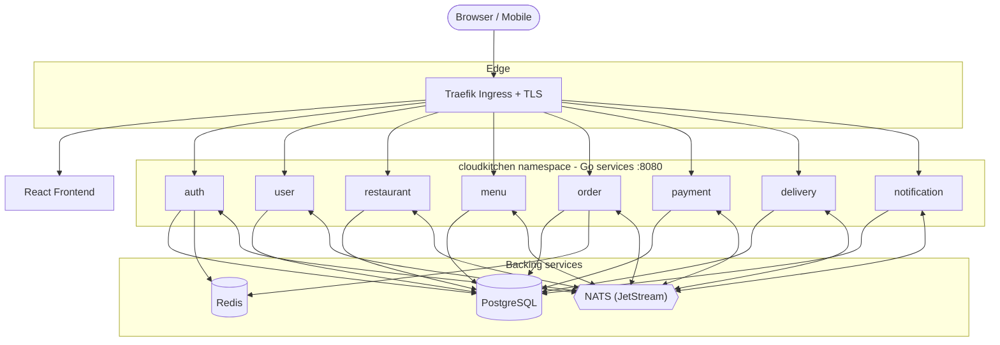
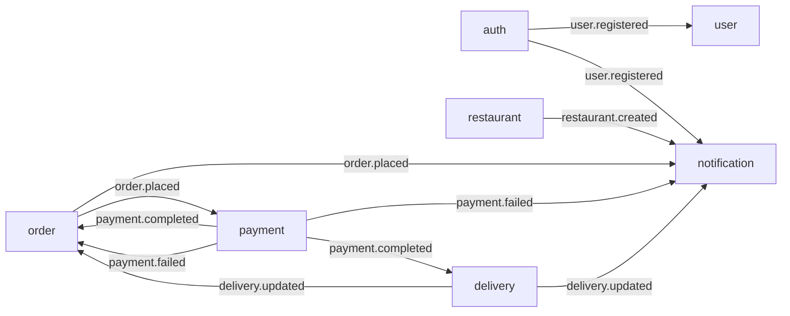
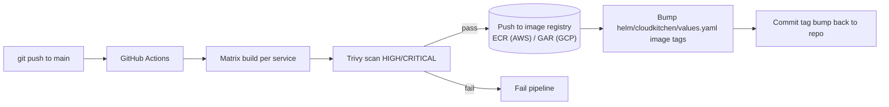
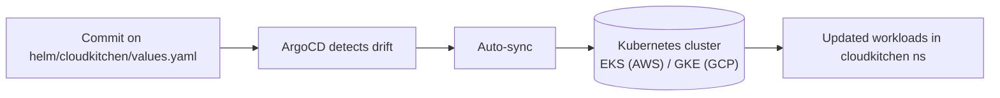

# CloudKitchen — Phase 1 Architecture

> A cloud-native, microservices food-delivery platform. Phase 1 establishes the
> 8 backend services, the React frontend, the GitOps deployment pipeline, and
> the full observability/security baseline.

## 1. High-level architecture



- **Frontend**: React SPA served by nginx; talks to the services through Traefik.
- **8 Go microservices** listen on `:8080`, each exposing `/metrics`, `/healthz`,
  `/readyz`, and structured JSON logs to stdout.
- **Sync** communication is REST over HTTP. **Async** communication is event-driven
  over NATS JetStream.
- **PostgreSQL** is the system of record; **Redis** handles sessions/caching;
  **NATS (JetStream)** is the event bus.

## 2. Flat repository layout

This repo is a **flat, single-repo monorepo** — one top-level directory per
service plus shared platform/infra directories:

```
cloudkitchen-app/
├── auth/                 # Go service: authentication, JWT issuance
├── user/                 # Go service: user profiles
├── restaurant/           # Go service: restaurant management
├── menu/                 # Go service: menu items
├── order/                # Go service: order lifecycle
├── payment/              # Go service: payment processing
├── delivery/             # Go service: delivery tracking
├── notification/         # Go service: notifications (email/push)
├── frontend/             # React SPA
├── helm/                 # Helm chart(s) for the services
├── aws-terraform/        # AWS infra (VPC, EKS, ECR, IAM/IRSA) — us-east-1
├── gcp-terraform/        # GCP infra (VPC, GKE, Artifact Registry, IAM) — us-central1
├── argocd/               # ArgoCD Applications / App-of-Apps
├── monitoring/           # Prometheus + Grafana (this phase)
├── logging/              # Loki + Promtail (this phase)
├── security/             # cert-manager, network policies, PSS, trivy, secrets
├── docker/               # docker-compose local stack
├── scripts/              # build/seed/port-forward/kubeconfig helpers
├── docs/                 # architecture + docs index
├── .github/              # GitHub Actions CI workflows
└── README.md
```

Each service directory contains its own `Dockerfile` (built by CI and by
`docker/docker-compose.yml`).

## 3. Service communication

### Synchronous (REST)
- Frontend -> services via Traefik.
- Service-to-service calls inside the `cloudkitchen` namespace over HTTP `:8080`
  (e.g. `order` validates a user via `user`, prices items via `menu`).
- All inter-service traffic is constrained by NetworkPolicies (see `security/`).

### Asynchronous (NATS JetStream events)

Events flow over a single JetStream stream called **`CLOUDKITCHEN`**. Each event
type maps to a NATS **subject** under the `cloudkitchen.` prefix — the broker
package prepends it automatically, so call sites still publish bare event names
like `order.placed` (internally published to subject
`cloudkitchen.order.placed`). Each consumer registers a **durable consumer** on
the stream that filters by the subjects it cares about.

| Concept (old: RabbitMQ) | Concept (new: NATS JetStream) |
|---|---|
| Topic exchange `cloudkitchen.events` | Stream `CLOUDKITCHEN` |
| Routing key (e.g. `order.placed`) | Subject (e.g. `cloudkitchen.order.placed`) |
| Queue + binding per consumer | Durable consumer on the stream |
| `ack` / `nack` | `ack` / `nak` (with `MaxDeliver=2`) |

**Delivery semantics:** at-least-once. JetStream persists messages with
**FileStorage**, consumers use **AckExplicit**, and `MaxDeliver=2` means a
handler that returns an error is retried exactly once before the message is
dropped — functionally identical to the previous RabbitMQ behaviour.



| Event                | Published by | Consumed by                | Meaning |
|----------------------|--------------|----------------------------|---------|
| `user.registered`    | auth         | user, notification         | New account created |
| `restaurant.created` | restaurant   | notification               | New restaurant onboarded |
| `order.placed`       | order        | payment, notification      | Customer submitted an order |
| `payment.completed`  | payment      | order, delivery            | Payment succeeded -> fulfil + dispatch |
| `payment.failed`     | payment      | order, notification        | Payment failed -> cancel + notify |
| `delivery.updated`   | delivery     | order, notification        | Delivery status changed |

This keeps services loosely coupled: `order` does not block on payment/delivery;
state propagates through events.

## 4. CI/CD flow (GitHub Actions)

CI **builds and publishes images and bumps the env values file** — it does NOT
run `helm upgrade`. Deployment is left entirely to GitOps (ArgoCD).



1. **Matrix build** — one job per service (`auth … notification`) builds its
   Docker image tagged with the commit SHA.
2. **Trivy gate** — image scanned; `HIGH`/`CRITICAL` (fixable) findings fail the
   job and block the push.
3. **Push to image registry** — image pushed to the per-service repo. On AWS this is **ECR** (`us-east-1`); on GCP this is **Artifact Registry** (`us-central1`). The CI workflow under `.github/workflows/` is what selects the target.
4. **Bump values** — CI updates the image tags in `helm/cloudkitchen/values.yaml`
   and **commits** that change back to the repo.
5. **No `helm upgrade` in CI.** The committed tag change is the deploy trigger.

## 5. GitOps flow (ArgoCD)



1. ArgoCD watches the repo (App-of-Apps in `argocd/`).
2. The CI tag bump makes the live cluster drift from desired state.
3. ArgoCD **auto-syncs** the Helm release to the Kubernetes cluster (EKS or GKE, depending on which terraform tree you applied).
4. Rollout completes; new pods are scraped by Prometheus and logged by Promtail.

This gives a clean separation: **CI produces artifacts + desired state; ArgoCD
reconciles the cluster to that state.**

## 6. Observability & security baseline (Phase 1)

- **Metrics**: kube-prometheus-stack scrapes `/metrics`; Grafana dashboards for
  CPU, memory, pod health, HTTP request rate, and 5xx error rate. (`monitoring/`)
- **Logs**: Promtail tails the `cloudkitchen` namespace, parses JSON, ships to
  Loki. (`logging/`)
- **Security**: restricted PSS, non-root containers, **workload identity** (IRSA on EKS / Workload Identity on GKE), External Secrets,
  default-deny NetworkPolicies, Let's Encrypt TLS via cert-manager, Trivy
  scanning. (`security/`)
